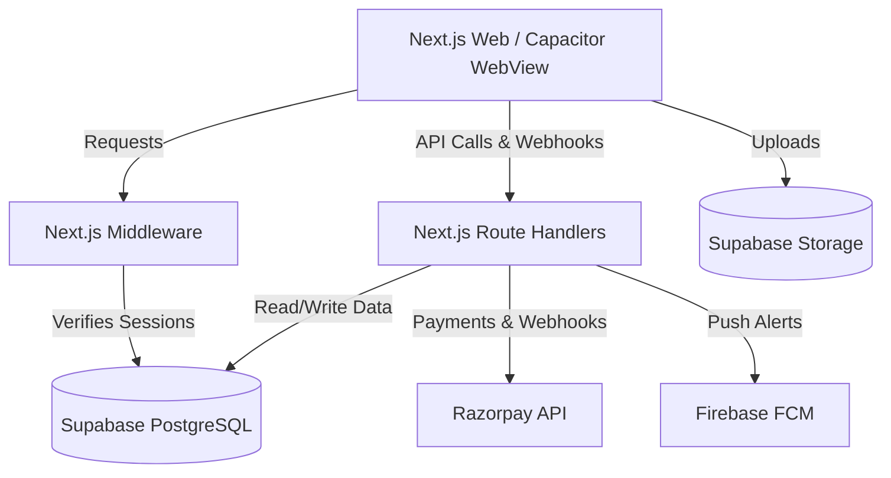

# Project Summary: Varun's Online (VO)

**Varun's Online** is a multi-sided hyperlocal e-commerce and delivery platform designed to connect local customers, shop owners, and delivery partners. Think of it as a premium, regional version of Dunzo or Instamart, featuring real-time order tracking, merchant onboarding, driver dispatching, integrated wallet systems, and in-app customer-merchant-driver messaging.

---

## 🛠️ Technological Architecture & Stack

The platform is designed to be accessible as a web application and also compiled directly into native mobile applications via Capacitor.

*   **Frontend & Core Framework**: Next.js 16 (App Router) using React 19 and Tailwind CSS 4.
*   **Mobile Wrapper**: Capacitor integration (`@capacitor/core`, `@capacitor/android`, `@capacitor/status-bar`, `@capacitor/splash-screen`) configured in **Remote URL mode** loading the live production deployment (`https://www.varunsonline.com`).
*   **Database & Backend services**: Supabase (PostgreSQL with Row Level Security policies, database triggers, and Realtime subscriptions for orders, notifications, and chats).
*   **File Storage**: Supabase Storage buckets (`shop-images`, `product-images`, `shop-documents`, `agent-documents`) with folder-based access controls.
*   **Payments & Webhooks**: Razorpay API integration for checkout generation and secure webhook-driven order confirmations.
*   **Push Notifications**: Firebase Cloud Messaging (FCM) using `firebase-admin` on the server-side and `@capacitor/push-notifications` client-side.
*   **Map & Geocoding**: Geolocation coordinates API, reverse-geocoding via OpenStreetMap's Nominatim, and visual maps linking to OpenStreetMap and Google Maps.
*   **Testing**: Vitest suite for GPS logic, rate-limit middleware, and logging validation.

---

## 🗄️ Database Schema & Data Model

The PostgreSQL database (managed via Supabase) is built on top of the following core tables:

| Table | Description |
| :--- | :--- |
| **`profiles`** | Extends Supabase's `auth.users` with specific roles (`customer`, `shopkeeper`, `delivery_agent`, `admin`), full name, phone number, and status. |
| **`platform_settings`** | Global admin parameters: delivery charges, shop searching radius (km), platform fee percentages, and minimum/maximum order bounds. |
| **`shops`** | Store profiles including metadata, category, coordinates, approval status, rating, total orders, banking details, and current balance. |
| **`products`** | Shop items listing product details, MRP, actual selling price, stock quantities, and availability states. |
| **`addresses`** | Customer location profiles with detailed text labels and latitude/longitude coordinates. |
| **`delivery_agents`** | Partner profiles tracking approval state, vehicle details, live coordinates, earnings wallet, and delivery history. |
| **`orders`** | Core transactional record tracking customer, shop, agent, address, pricing splits (shopkeeper/agent/admin earnings), Razorpay transaction ids, and delivery timestamps. |
| **`order_items`** | Lines detailing the products and units bought in an order. |
| **`order_status_history`** | Chronological record of transitions (e.g. `placed` ➔ `shop_accepted` ➔ `picked_up` ➔ `delivered`) for audit logs. |
| **`wallet_transactions`** | Ledger entries tracking credits/debits for shopkeepers and delivery agents. |
| **`withdraw_requests`** | Tracks money payouts from wallets to merchants and drivers (processed by the administrator). |
| **`order_conversations` & `order_messages`** | Support for instant messages between order participants (customer, merchant, agent, admin). |
| **`reviews`** | Customer ratings and written feedback left for shops. |

---

## 👥 Core Portals & User Roles

### 1. Customer Experience (`/customer`)
*   **Landing Page (`/splash`)**: A beautiful, branded entrance sequence showing a pulsing logo that redirects into the application.
*   **Shop Discovery**: Geolocation-based indexing showing approved, open shops within the specified delivery radius.
*   **Ordering Flow**: Adding items to the shopping cart, selecting/adding customer addresses, applying coupon discounts, and checking out.
*   **Payment Checkout**: Integrated Razorpay modal supporting Card, UPI, and Netbanking.
*   **Real-time Tracking**: Interactive order page showcasing chronological progress status, estimated delivery times, and direct chat channels with the shopkeeper or driver.

### 2. Shopkeeper Dashboard (`/shopkeeper`)
*   **Onboarding (`/login/shopkeeper`)**: Registration flow requiring company information and verification documents (Aadhar, Trade License, GST certificate) uploaded to secure folders.
*   **Catalog Management**: Modifying available products, updating selling prices, tracking stock, and featuring products.
*   **Order Control Center**: Alerts for incoming orders, simple click-to-accept or reject flows, order packing updates, and real-time coordination chat.
*   **Wallet & Payouts**: Real-time earnings tracker and history, with a portal to submit withdrawals to banks/UPI.

### 3. Delivery Agent Interface (`/delivery`)
*   **Onboarding (`/login/delivery/register`)**: Submission of Driver's License, Aadhar Card, vehicle type/plate number, and live photo.
*   **Dispatcher Actions**: Toggling availability state. When active, agents are notified of pending orders, allowing them to accept and claim deliveries.
*   **Navigation & Milestones**: GPS status verification, links to open routes in external navigation (Google Maps, OpenStreetMap), and step-by-step progress updating (marked picked up, marked delivered).
*   **Finances**: Live wallet accounting showing payouts for successful deliveries and request tools to withdraw funds.

### 4. Administrative Backoffice (`/admin`)
*   **Onboarding Verification**: View uploaded PDFs and images for pending shopkeepers and delivery agents to approve/deny their credentials.
*   **Order Auditing**: View details of live orders, status changes, and assigned delivery routes.
*   **Payout Controls**: Review pending withdrawal requests, reconcile balances, and mark transfers as paid.
*   **System Configuration**: Live updating of platform settings (e.g. base fees, per-km rates, limits).

---

## 🔒 Security, RLS & Authentication Design

1.  **Row Level Security (RLS)**:
    All tables have RLS policies. For example, order conversations are restricted to participants of that specific order (customer, merchant, driver) and system admins. Shop owners can only modify products belonging to their shop folder structure.
2.  **Authentication Middleware**:
    *   Next.js `middleware.ts` utilizes Supabase `getSession()` (cookie-based reading) to perform fast route checks, protecting pages from unauthorized entry while avoiding unnecessary database requests.
    *   API routes where data integrity is critical perform deep, network-validated security audits using `getUser()`.
3.  **Content Security Policy (CSP)**:
    Rigorous CSP policies are added directly in responses, allowing secure frames and connection scopes only for Razorpay checkout, database backends, and local domain resources.

---

## 🔄 Recent Work & UI Optimizations

*   **Admin Access Simplification**: Removed the "Admin" card from the public login screen to clean up the user entry UI, maintaining the `/admin/login` url for internal admins.
*   **Authentication Redirection Repair**: Resolved infinite loop issues on admin dashboards. Modified client-side transitions to reload after authorization, assuring cookies sync correctly between client and middleware contexts.
*   **Auth Session Stabilization**: Replaced aggressive sign-out calls that occurred during brief network disconnections, allowing users to remain logged in when moving between navigation tabs or experiencing latency.
*   **Withdrawal Processing Security**: Migrated withdrawal actions from client-side DB edits to a dedicated secure server-side API endpoint, validating wallet balances before queueing transactions.
*   **GPS Tracking Resiliency**: Fine-tuned GPS location checking and accuracy tolerances to prevent incorrect location reports during agent handoffs.
